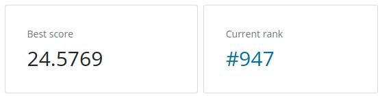
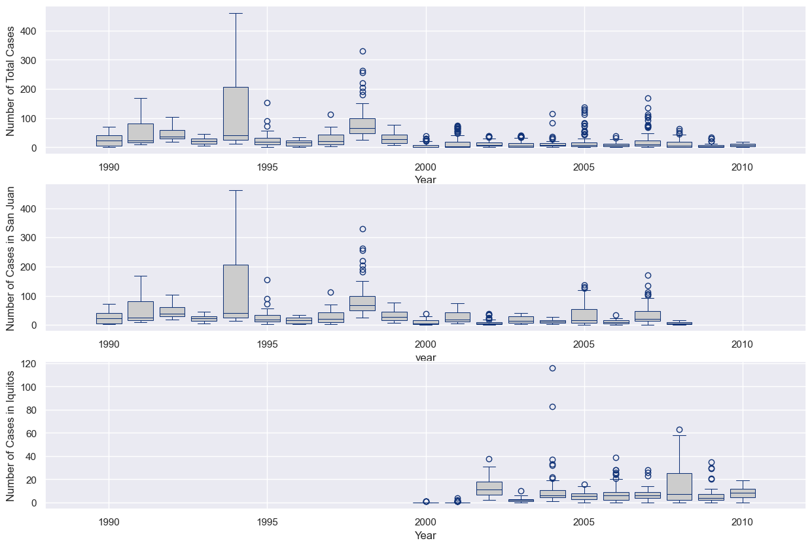
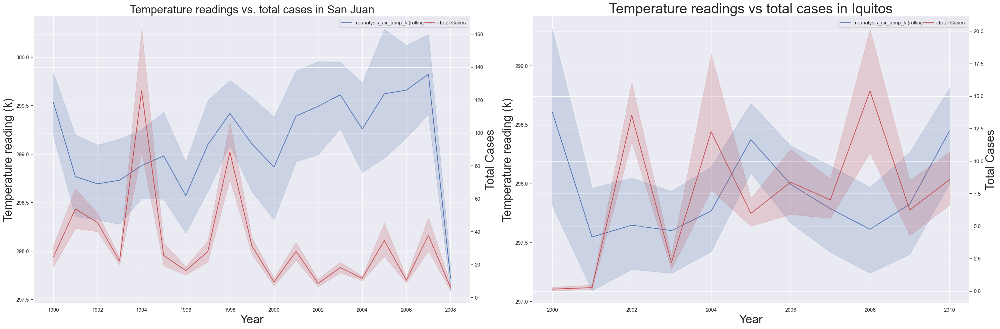

# Dengue Fever Prediction

This repository contains the code and models developed for the [Dengue Prediction competition](https://www.drivendata.org/competitions/44/dengai-predicting-disease-spread/page/80/) hosted on [drivendata.org](https://www.drivendata.org). The goal of this competition is to **predict the number of dengue fever cases** each week in two cities: San Juan, Puerto Rico, and Iquitos, Peru.

We used the open-source [Kedro](https://kedro.org/) framework for project structure and end-to-end implementation.

## Outcomes

**Final submission score: ``24.55 ``**
**Final submission rank: ``940``**



Submitted predictions visualized.


We used the **Random Forest Regressor** with the following hyperparameters:
- max_depth: 10
- n_estimators: 500
- random_state: 42
- min_sample_split: 5

## Try it out
You can run this repository locally to test it out. To use the conda commands, you should have Anaconda installed for this:
1. Clone this repository into a local project folder: 
    ```bash
    git clone git@github.com:Lucamiras/DengAI.git
    ```
2. Create a new conda environment for this project (as we need to install some packages):
    ```bash
   conda create -n [YOUR ENVIRONMENT NAME] python=3.12
    ```
4. Go to your cloned repository:
    ```bash
   cd DengAI
    ```
6. Activate your new environment:
    ```bash
   conda activate [YOUR ENVIRONMENT NAME]
    ```
8. Install dependencies:
    ```bash
   pip install -r requirements.txt
    ```
10. To run the full pipeline:
    ```bash
    kedro run --pipeline __default__
    ```
12. Once the pipeline has run, you can find the new predictions file ``submissions.csv`` in ``data/07_model_output``

## Data exploration
We plotted the development of total cases to get an intuition for features that impact number of cases:

Looking at the distribution over time by city, we see spikes of outbreaks around the years '91, '94, '98, '05 and '08.



Looking at ``min_air_temperature_k`` readings seem to align with spikes in ``total_cases``. This variable was interesting to us because literature suggests that minimum temperature has a strong impact on mosquito populations.



Vegetation was highly correlated with the target variable, so we plotted it over time for both cities to check on any noticable patterns.


## Feature engineering
These choices led to the biggest improvement in score:
- Forward-filled missing values. Forward-fill seemed the best choice for time-series problems.
- Since mosquito infestations are correlated temporally (in the future) with past rainfall and temperature rises, we use a rolling window approach to encode the past as new features.
- For this we implemented rolling averages of 2, 4 and 6 weeks into the past respectively for many temperature, humidity and precipitation related features.  This allows the model to understand how time lag impacts new cases.
- The variables we implemented rolling averages in this version are:
  - 'reanalysis_tdtr_k'
  - 'reanalysis_min_air_temp_k'
  - 'station_min_temp_c'
  - 'reanalysis_air_temp_k'
  - 'reanalysis_avg_temp_k'
  - 'reanalysis_dew_point_temp_k'
  - 'reanalysis_specific_humidity_g_per_kg'
  - 'station_avg_temp_c'
- In order to enforce week of year (0--52) to also show proximity of the end of the year to the beginning, we implemented cyclical encoding for ``weekofyear`` mapping the weeks (52) on a circle to cartesian coordinates thereby introducing Eucledian proximity in a distance score.
- Ideally one would use the number of cases in past weeks to also indicate trends for future predictions. However, given that the test data does not provide this data, it was ignored so as not to predict into the far  future, using predictions of the near future. Doing that would result in uncontrolled drift and hence was not introduced.

## Repository Structure
- **conf**: Contains Kedro config files.
- **data**: Contains the raw datasets used in the project.
- **images**: Images used in this notebooks, mainly data visualizations.
- **src**: Python files for two Kedro pipelines:
    - Data Processing: Handle null values, create rolling averages, encodings, dropping unused columns
    - Data Science: Split data into X and y, train model, create submissions
- **README.md**: Overview of the project, outcomes, and implementation notes (you're here!).

## Noteworthy
- In this project, we are training the model on the entire dataset. In a previous version we used train and validation sets, but found that our validation score was almost never reflecting a real submission score increase. Due to this and the time series nature of the problem, we chose to train the model on the whole dataset after first figuring out the best hyperparameters on a train-val-split of 80/20.

## Acknowledgements
Thanks to Data Science Retreat, our teacher Paul Mora, as well as the team, Arian & Rahul.
